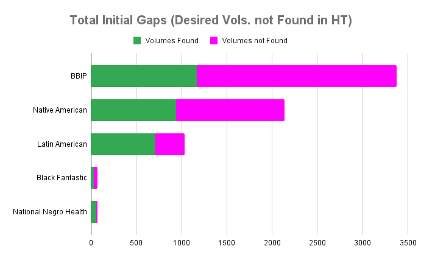
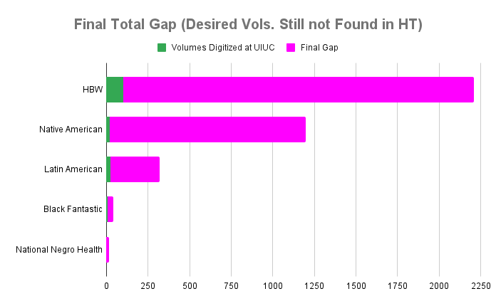
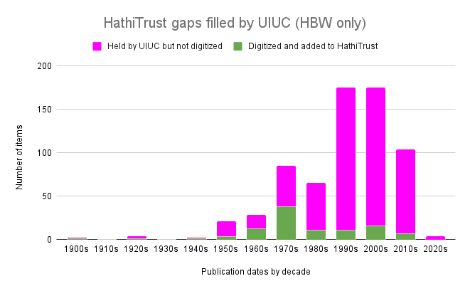

# Report on HathiTrust Gap Filling
By Isabella Magni, Glen Layne-Worthy, John A. Walsh, J. Stephen Downie, Maryemma Graham, Janet Swatscheno, and Ryan Dubnicek

Given the legal history of text and data mining (Grimmelmann 2016) and corresponding digitization policies and initiatives, the search for relevant materials for non-canonical cultural research is often one that ends with empty hands. The SCWAReD project attempts to pilot and examine a workflow for filling gaps in incomplete digital collections–gaps that too often silence voices and perspectives at the periphery. The emphasis on recovering and documenting existing marginalized (or “hidden”) portions of collections implies the discovery and potential remediation of gaps in a digital library collection that hopes to be reasonably comprehensive. 
 
The causes of neglect and marginalization of certain texts and textual communities are many, beginning with historical injustices related to the social, economic, and cultural conditions in which these texts were first produced, distributed, collected, and preserved (Bledsoe et al 2022, Bode 2020, Mak 2014, Proffitt 2023, Bonde Thylstrup 2019, Brown, et al. 2019, and Bainbridge, et al. 2020). What we must recognize, and what our project seeks to address, is that such injustices persist in library collections and continue today in our own library practice. The HathiTrust Digital Library is only as complete as the collections of its contributing member libraries, in which historical injustices are of course reflected. At the same time, similar historical injustices have impeded the development of infrastructures required to allow under-resourced non-member libraries (many of which have collections that could indeed fill important gaps) to join HathiTrust and contribute. The SCWAReD project cannot, of course, even begin to address the deepest of these injustices, nor can it remove the barriers to participation in HathiTrust. But what it can do is to identify some of the intellectual consequences of those injustices (“collection gaps,” for want of a better term), and adopt innovative strategies for outreach and engagement in the recovery and inclusion of missing materials through available means.

## Objectives of the gap-filling effort

The main goal of SCWAReD is to highlight and center the work of historically under-resourced and marginalized textual communities. For this purpose, a [flagship project](https://htrc.github.io/scwared-history-of-black-writing/) and [four sub-projects](https://htrc.github.io/scwared/) were selected competitively: each of them explores new methods for creating, analyzing, and reusing curated digital collections and the research data derived from them. SCWAReD aims to help address these inequities in both library collections and digital humanities research by identifying and remediating gaps within HathiTrust. These are some of the main objectives of the gap-filling efforts:
- to identify items that scholars from each sub-project wanted in their own worksets, responding to their own research needs – and which, by extension, we believe should be part of the HT collection;
- to identify which of those works are missing from the HT collection;
- to remediate the collection in order to get the works included.

## Identifying the Gaps

The gap identification process went hand in hand with workset building. The main approach in building SCWAReD worksets was to conduct a bulk search of the HT catalog for all the volumes included in lists created and curated by our scholar-collaborators: bibliographies of works that meet the criteria of their respective research questions, such as novels from certain genres, or written by authors of a certain demographic, etc. The volumes _found_ in the HT catalog were included in each project’s initial workset(s); the volumes _missing_ from the HT catalog are considered the “gaps.” 

Since there is no objective “complete list” of desirable titles for the “comprehensive digital library,” but rather only lists created for specific projects and research interests/questions, our general standard was to base a workset on a particular scholarly need.  In some cases this need is a non-comprehensive one (e.g., one based on a particular research question), and in other cases, is intended to be comprehensive only within a particular genre, author demographic, or field. This is one explanation for the different relative gap sizes: a gap of nearly ⅔ for the History of Black Writing list (which aims at comprehensiveness for Black-authored fiction regardless of prominence or obscurity) compared with less than ⅓ for Latin American Fiction and the National Negro Health Project (which are both intended as more narrowly-curated lists).

Below (Table 1 and Figure 1) is an overview of the “initial gaps”: the total number of items desired for project worksets but not found in HathiTrust.

| _Project_ | _Total # of items desired for worksets_ | _The gaps: # (and % of total) of desired items not found in HT_|
| :------ | :----- | :------ | 
| Black Book Interactive Project (BBIP) / History of Black Writing| 3,375 | 2,208 (65.4%) |
| Black Fantastic | 72 | 39 (54.2%) |
| National Negro Health Project | 56 | 16 (28.6%) |
| Latin American Fiction | 1,033 | 321 (31.0%) |
| Native American Authored Works | 2,135 | 1,198 (56.1%) |
| _Totals_ | 6,599 | 3,743 (56.7%) |

_Table 1: Quantification of collection gaps.  Note that the “Black Fantastic” list of desiderata is a proper subset of the “Black Book Interactive Project” list, and is not included in the Totals._

_Figure 1. Comparison of collection gaps across projects._

## Filling the gaps

Once collection gaps were identified based on the desired title list of each of the projects, we began exploring the possibility of new, targeted digitization of HathiTrust member library collections, and their ingest into the HathiTrust collection. Recognizing the complexities at all stages of our proposed process, we focused on a single member library, the University of Illinois Urbana-Champaign Library, as a pilot project, rather than immediately trying to survey all the member library collections simultaneously, recognizing both the significance and scope of UIUC’s collection and its well-established digitization and contribution-to-Hathi workflows.

We used a similar approach here as we had for initially creating worksets and identifying gaps: a bulk-search of the UIUC catalog. Having discovered a substantial number of potentially gap-filling items in the collection, we shared a list of just over a thousand with a request to digitize them through whatever channels the Library had available. 

### Results of gap filling

Understandably for a special request of this size, and given the conflicting complexities of various digitization workflows, policies, and priorities, the UIUC Library was not able to accommodate all of those requests over the time of the project, but it did contribute to filling over 4% of the initial gap across all the SCWAReD projects in a relatively brief period of time, which represents a genuine contribution to the improvement of the HT collections, and for which we’re grateful. (The process also revealed a number of obstacles and pain points in targeted bulk-digitization, which we have documented in an internal report and hope to address in future gap-filling efforts. This situation is very complicated, but chief among the obstacles was the lack of Library agency in what external digitization partners such as Google choose to accept into their workflows.)

We would also emphasize that this effort was intended only as a time-limited pilot, and that UIUC is just one of more than 200 HathiTrust member libraries, and thus potential partners in gap-filling. The community aspect of gap-filling is another major area we will address in future work; while partnering with many libraries instead of just one will add an additional layer of administrative complexity, we believe the potential gain to be large, especially without the time constraints of a grant-funded project.

Below (Table 2 and Figure 2) is an overview of the overall results of pilot gap filling efforts accomplished in collaboration with the UIUC Library.

| _Project_ | _# (% of gap) of gap volumes found in UIUC catalog_ | _# (% of gap) of items newly added to HT collection_ | _Final gap # (% of total) of desired items still not found in HT |
| :------ | :----- | :------ | :------ | 
| Black Book Interactive Project (BBIP) / History of Black Writing| 625 (28.3%) | 102 (4.6%) | 2,106 (62.4%) |
| Black Fantastic | 12 (30.8%) | 5 (12.8%) | 34 (47.2%) |
| National Negro Health Project | 0 | 0 | 16 (28.6%) |
| Latin American Fiction | 72 (22.4%) | 23 (7.2%) | 298 (28.8%) |
| Native American Authored Works | 308 (25.7%) | 21 (1.8%) | 1,177 (55.1%) |
| _Totals_ | 1,005 (26.9%) | 151 (4.0%) | 3,597 (54.5%) |

_Table 2: Quantification of collection gaps filled (and remaining). Note that the “Black Fantastic” list of desiderata is a proper subset of the “Black Book Interactive Project / History of Black Writing” list, and is not included in the Totals. Refer to Table 1 for initial gap and total figures used for calculation of percentages._

_Figure 2. Comparison of collection gaps filled (and remaining) across projects._

### Simple analyses of gap-filling results

In addition to identifying and requesting digitization of individual items needed to fill our scholar-identified collection gaps, we also did a very simple analysis (among many possible analyses) of the nature of those gaps that were filled through UIUC Library digitization. In particular, we wished to understand how publication dates are reflected in both Library holdings in the gap area, and its successful digitization. Figure 3 is the result of that analysis.

_Figure 3. Number of potential gap-filling items held by the UIUC Library, and of those successfully targeted for digitization, by decade of publication._

Our initial assumption was that gap-filling digitization would be concentrated among older publications – that is, that books not currently subject to copyright restrictions would be more readily digitized – but that proved not to be the case. Although the UIUC Library is a rich source of potentially gap-filling works from the 1990s-2000s, the 1970s were rather better served by the vicissitudes of third-party digitization (which accounts for the vast majority of HT content, both in UIUC’s digitization efforts and in general).

We had also assumed that the gaps themselves would be especially heavy with older items, that is, those less likely to have been collected by research libraries which only relatively recently focused their efforts on works from previously under-represented textual communities. (Our publication metadata for the overall gaps, unlike that for the UIUC Library collections, is not robust enough for an analysis like this, but the overall shape of the gaps appears to be similar: quite a bit smaller than expected gaps in the early decades of the 20th century and before, and much larger in the more recent decades.)

## Conclusions

As immense and multifaceted as the HathiTrust collections are, they are necessarily incomplete for reasons equally multifaceted.  And while the SCWAReD experience of working with highly specialized scholarly teams to identify collection gaps has proven to be a fruitful one, the effort to fill the gaps identified by those teams is likewise a multifaceted and complicated one. Nevertheless, we have shown that filling those gaps, and making the HathiTrust collections incrementally more complete and more representative, is indeed possible, but requires (and will continue to require) thoughtful, collaborative work on a long timeline, and in concert with the same HathiTrust community that together collected, curated, and created the collections in the first place.  

# References
Kara Bledsoe et al. _Leading by Diversifying Collections: A Guide for Academic Library Leadership_.  Ithaka S+R, 2022. https://doi.org/10.18665/sr.317833.

Katherine Bode, “Why you can’t model away bias.” _Modern Language Quarterly_ 81.1 (March 2020).

Bonnie Mak, “Archaeology of a Digitization.” _Journal of the Association for Information Science & Technology_, vol. 65, no. 8, Aug. 2014, pp. 1515–26.

Merrilee Proffitt, “Casting a different net: Diversifying print monograph collecting in research libraries.”  _Hanging Together: the OCLC Research Blog_, March 9, 2023.  https://hangingtogether.org/casting-a-different-net-diversifying-print-monograph-collecting-in-research-libraries/

Nanna Bonde Thylstrup, _The Politics of Mass Digitization_. Cambridge, MA: MIT Press, 2019.

Nicole M. Brown, Ruby Mendenhall, Michael Black, Mark Van Moer, Karen Flynn, Malaika McKee, Assata Zerai, Ismini Lourentzou & ChengXiang Zhai, “In Search of Zora / When Metadata Isn’t Enough: Rescuing the Experiences of Black Women Through Statistical Modeling.” _Journal of Library Metadata_ 19, no 3-4 (2019):, 141- 162, https://doi.org/10.1080/19386389.2019.1652967

David Bainbridge, J. Stephen Downie, Hemi Whaanga. An Open Data Approach to Revealing Indigenous Texts in Large-Scale Digital Repositories: A Case-Study of Locating Pages of Māori Text in the HathiTrust. In Laura Estill, Jennifer Guiliano, editors, _15th Annual International Conference of the Alliance of Digital Humanities Organizations, DH 2020, Ottawa, Canada, July 20-25, 2020, Conference Abstracts_. 2020, https://dh2020.adho.org/wp-content/uploads/2020/07/669_AnOpenDataApproachtoRevealingIndigenousTextsinLargeScaleDigitalRepositoriesACaseStudyofLocatingPagesofMoriTextintheHathiTrust.html
